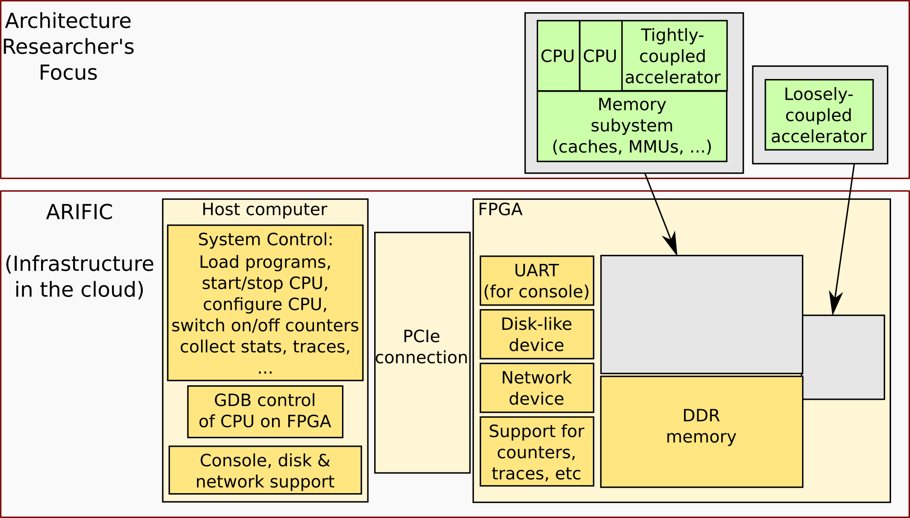

= ARIFIC: Architecture Research in FPGAs in the Cloud
Rishiyur S. Nikhil
:revnumber: v1.0, 2022-11-12
:sectnums:
:toc:
:toclevels: 4
:toc: left
:toc-title: Contents
:description: README for git repo for tutorial on ARIFIC at HPCA-29 (Montreal, Canada, Feb/Mar 2023)

:FOO: ARIFIC

// SECTION ================================================================

This is the repository for a 1/2 day tutorial, "`{FOO}: Architecture
Research in FPGAs in the Cloud`" at the _29th IEEE International
Symposium on High-Performance Computer Architecture (HPCA-29)_,
Montreal, Canada, February 25-March 01, 2023, taught by Rishiyur
S. Nikhil (Bluespec, Inc.)

This page describes the plan for the tutorial.

Just before the tutorial, this repo will be updated to contain
artefacts enabling participants to replicate the tutorial demos, and
to then conduct their own research.

NOTE: This document's source is `README.adoc`, in "`AsciiDoc`" format.
      GitHub automatically runs it through the `asciidoctor` tool and
      displays the resulting.  In your local clone: install the
      `asciidoctor` tool and `make` to produce `README.html`.

// SECTION ================================================================

== What is {FOO}?

{FOO} is an *infrastructure* for researchers in CPU microarchitecture,
memory systems (caches, MMUs, coherence, Weak Memory Models, ...)  and
accelerators, and is illustrated in the figure below.  While GEM,
QEMU, and other artefacts are available for research conducted
entirely in software simulation, they may be too slow or can lack
micro-architectural accuracy.  {FOO} provides infrastructure for
*FPGA-based* experiments.  It runs out-of-the-box on Amazon's AWS
cloud on "`F1`" instances (cloud machines with attached FPGA boards).

The infrastructure frees researchers to focus on their architectural
artefacts, and to take for granted the following capabilities
necessary to support research on the artefact:

* Load and run programs on the RISC-V core in the FPGA

* Interact with programs on the RISC-V core in the FPGA using a terminal console

* Compile, run and debug (with standard GDB): bare-metal
  C and Assembly Language programs, including ISA Tests

* Boot an embedded Linux kernel, with storage and networking device support

* Compile and run C and Assembly Language programs under embedded Linux, with storage and networking device support

* Dump performance data from the FPGA to the host

Architecture researchers can easily substitute their own new or
modified RISC-V CPU core/memory system/accelerator into the {FOO}
infrastructure and use all the above capabilities.  The replacement
artefact can be written with any design flow that can produce
synthesizable Verilog (Verilog, SystemVerilog, Bluespec, Chisel, HLS,
...).

NOTE: {FOO} is a variant of a commercial product from Bluespec, Inc.  It
      is free for tutorial participants and free for academia/research
      (non-commercial).

// SECTION ================================================================

== Tutorial Plan

The format of the tutorial will be descriptions and live
demonstrations on an Amazon AWS F1 instance of the topics listed
below.  The goal is to enable participants to replicate all these
actions on their own after the tutorial, using their own Amazon AWS
account and the supplied tutorial materials.

Then, participants can explore their own architectural ideas by modifying
the open-source CPUs used in the demos, or replacing them entirely
with their own designs.

Topics:

* Basics of using Amazon AWS and Amazon's FPGA Developer AMI (free
  virtual machine pre-loaded with Xilinx FPGA tools and Amazon's
  `aws-fpga` development kit).  We do not assume any prior experience
  with Amazon AWS.

* Description and demo of capabilities provided by the infrastructure:

  ** Run RISC-V ISA tests.

  ** Cross-compile a C program into a RISC-V ELF binary to run on bare-metal RISC-V (no OS).

  ** Run a RISC-V ELF binary on bare-metal RISC-V.

  ** Debug (with GDB) a bare-metal ELF binary.

  ** Boot an embedded Linux kernel, with block-device and network-device support.
     Use `ssh` and `scp` in Linux on the RISC-V.

  ** Cross-compile a C program into a RISC-V ELF binary to run under Linux.

  ** Run a RISC-V ELF binary under Linux.

  ** Dump performance data from the FPGA to the host.

  ** Perform all these actions on a local machine with Verilator-based simulation.

* Description and demo of hardware-build flow where architecture
    researchers plug in their own modified subsystem (grey boxes in
    the diagram above) containing their new or modified RISC-V core,
    memory subystem, and/or accelerator:

  ** RTL interfaces for the plug-in.

  ** Range of capabilities/options for the plug-in: from
     microcontrollers to Linux-capable server-class CPUs; RISC-V Debug
     Modules; RISC-V Interrupt Controllers; RISC-V Timers and
     Software-Interrupt support, accelerators.

  ** Example open-source RTL plug-ins used in the demos, incorporating:
     *** Rocket from Berkeley/SiFive/Chips Alliance
     *** Flute from Bluespec, Inc.

  ** FPGA-build flow, from RTL plug-in to AFI (AWS FPGA Image).  This
     uses Xilinx Vivado tools and Amazon `aws-fpga` tools, but we do
     not assume any prior experience with them.

  ** Verilator simulation flow of the full system.

// SECTION ================================================================

== Tool and artefact notes

* {FOO} is a variant of a commercial product from Bluespec, Inc.  It
  is free for tutorial participants and free for academia/research
  (non-commercial).

* The supplied tutorial materials are expected to include pre-built
    versions of:
    ** RISC-V Gnu toolchain (`gcc`, `gdb`, etc.) for cross-compiling and debugging
    ** OpenOCD for GDB debugging
    ** Embedded Linux

* Amazon AWS is a commercial service from Amazon; you will need to set up an AWS account.

* The major step in the hardware-build flow uses Xilinx Vivado tools.
  Amazon AWS provides a free "`FPGA Developer AMI`", which is a free
  AWS instance/virtual machine that is pre-loaded with a free Xilinx
  Vivado installation and license.  Alternatively, you can perform
  this step on your own local machine if you have your own Vivado
  installation and license.
+
The second step in the hardware-build flow uses Amazon AWS' tools, to produce
an AFI (AWS FPGA Image).  This is also free with the FPGA Developer AMI.

* All other artefacts are free and open-source.
