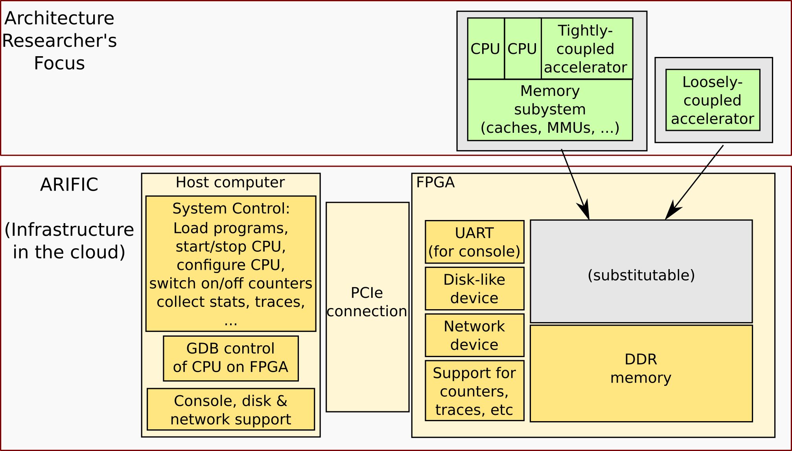

= ARIFIC: Architecture Research on FPGAs in the Cloud
Rishiyur S. Nikhil
:revnumber: v1.0
:sectnums:
:toc:
:toclevels: 4
:toc: left
:toc-title: Contents
:description: README for git repo for tutorial on ARIFIC at HPCA-29 (Montreal, Canada, Feb/Mar 2023)

:FOO: ARIFIC

// SECTION ================================================================

THIS DOCUMENT IS STILL UNDER CONSTRUCTION

(This document's source is README.adoc, in "`AsciiDoc`" format.  GitHub
automatically processes this displays it.  In your own clone: install
the 'asciidoctor' tool and do `make`.)

This is the repository for a 1/2 day tutorial, "`{FOO}: Architecture
Research of FPGAs in the Cloud`" at the _29th IEEE International
Symposium on High-Performance Computer Architecture (HPCA-29)_,
Montreal, Canada, February 25-March 01, 2023, taught by Rishiyur
S. Nikhil (Bluespec, Inc.)

This page describes the plan for the tutorial.

Just before the tutorial, this repo will be updated to contain all the
necessary artefacts for attendees to be able to replicate the tutorial
demos, and to then be able to use it for their own research.

// SECTION ================================================================

== What is {FOO}?

{FOO} is an *infrastructure* for researchers in CPU microarchitecture,
memory systems (caches, MMUs, coherence, WMMs, ...)  and accelerators,
and is illustrated in the figure below.  While GEM, QEMU, and other
artefacts are available for research conducted entirely in software
simulation, they may be too slow or can lack micro-architectural
accuracy.  {FOO} provides infrastructure for *FPGA-based* experiments.
It runs out-of-the-box on Amazon's AWS cloud on "`F1`" instances
(cloud machines with attached FPGA boards).

The infrastructure frees researchers to focus on their architectural
artefacts, and take for granted the following capabilities necessary
to exercise the artefact, debug it and measure it:

* Load and run programs on the FPGA

* Interact with programs on the FPGA using a terminal console

* Compile, run and debug (with standard GDB): ISA Tests and bare-metal
  C and Assembly Language programs

* Boot an embedded Linux kernel, with storage and networking device support

* Compile and run C and Assembly Language programs under embedded Linux, with storage and networking device support

* Dump performance statistics from the FPGA to the host

The architecture researcher can easily substitute their own new or
modified RISC-V CPU core/memory system/accelerator into the {FOO}
infrastructure and use all the above capabilities.  The replacement
artefact can be written with any design flow that can produce
synthesizable Verilog (Verilog, SystemVerilog, Bluespec, Chisel, HLS,
...).

NOTE: {FOO} is a variant of a commercial product from Bluespec, Inc.  It
      is free for tutorial attendees and free for academia/research
      (non-commercial).

// SECTION ================================================================

== Tutorial Plan

The format of the tutorial will be descriptions and live
demonstrations on an Amazon AWS F1 instance of the topics listed
below.  The goal is to enable attendees to replicate all these actions
on their own after the tutorial, using their own Amazon AWS account
and the supplied tutorial materials.

Then, attendees can explore their own architectural ideas by modifying
the open-source CPUs used in the demos, or replacing them entirely
with their own designs.

Topics:

* Basics of using Amazon AWS and Amazon's FPGA Developer AMI (free
  virtual machine pre-loaded with Xilinx FPGA tools and Amazon's
  `aws-fpga` development kit).  We do not assume any prior experience
  with Amazon AWS.

* Description and demo of capabilities provided by the infrastructure:

  ** Running RISC-V ISA tests.

  ** Cross-compiling a C program into a RISC-V ELF file, for bare-metal RISC-V (no OS).

  ** Running a bare-metal RISC-V ELF binary.

  ** GDB-debugging a bare-metal ELF binary.

  ** Booting an embedded Linux kernel, with block-device and network-device support.
     Using `ssh` and `scp` in Linux on the RISC-V.

  ** Cross-compiling a C program into a RISC-V ELF file to run under Linux,
     and running it under Linux.

  ** Running a RISC-V ELF binary under Linux.

  ** Dumping performance data from the FPGA to the host.

  ** Performing all these actions on a local machine with
     Verilator-based simulation.

* Description and demo of hardware-build flow where the architecture
    researcher plugs in their own modified or new RISC-V core, memory
    subystem, and/or accelerator:

  ** RTL interfaces for the plug-in.

  ** Range of capabilities/options for the plug-in: from
     microcontrollers to Linux-capable server-class CPUs; RISC-V Debug
     Modules; RISC-V Interrupt Controllers; RISC-V Timers and
     Software-Interrupt support, accelerators.

  ** Example plug-ins used in the demos, based on open-source RISC-V CPU cores.

  ** FPGA-build flow.  We do not assume any prior experience with
     Xilinx Vivado tools nor Amazon `aws-fpga` tools.

  ** Verilator simulation flow.

Descriptions and demos will be based on open-source RISC-V cores:
Rocket from Berkeley/SiFive/Chips Alliance and Flute from Bluespec,
Inc.  More cores may be available at tutorial time: Boom, Piccolo,
CVA6, ...

// SECTION ================================================================

== Tool and artefact notes

* {FOO} is a variant of a commercial product from Bluespec, Inc.  It
  is free for tutorial attendees and free for academia/research
  (non-commercial).

* The supplied tutorial materials are expected to include pre-built
    versions of:
    ** RISC-V Gnu toolchain (`gcc`, `gdb`, etc.) for cross-compiling and debugging
    ** OpenOCD for GDB debugging

* Amazon AWS is a commercial service from Amazon; you will need to set up an AWS account.

* The hardware synthesis flow that we describe is based on Amazon's
  "`FPGA Developer AMI`" (free AWS instance/virtual machine pre-loaded
  with free Xilinx Vivado license and tool).  You can alternatively
  perform this synthesis on your own local machine if you have a
  Vivado license and installation.

* All other artefacts are free and open-source.
